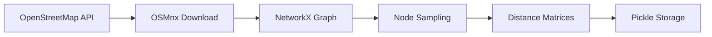

<div align="center">

# 🏥 Operation MedSwarm

### *Hybrid Multi-Agent Reinforcement Learning for Urban Disaster Triage*

[](https://www.python.org/downloads/)
[](https://gymnasium.farama.org/)
[](https://stable-baselines3.readthedocs.io/)
[](https://streamlit.io/)
[](https://opensource.org/licenses/MIT)

*A research project exploring cooperative multi-agent reinforcement learning for emergency medical logistics optimization in urban disaster scenarios.*

[📖 Documentation](#-quick-start) • [🚀 Quick Start](#-quick-start) • [📊 Dashboard](#-visualization-dashboard) • [🔬 Methodology](#-methodology) • [📁 Project Structure](#-project-structure)

</div>

---

## 📋 Table of Contents

- [Problem Description](#-problem-description)
- [Key Features](#-key-features)
- [Quick Start](#-quick-start)
- [Project Structure](#-project-structure)
- [Methodology](#-methodology)
- [Visualization Dashboard](#-visualization-dashboard)
- [Configuration](#-configuration)
- [Results](#-results)
- [Contributing](#-contributing)
- [License](#-license)

---

## 🌍 Problem Description

<table>
<tr>
<td width="60%">

In severe disaster or urban gridlock scenarios, standard routing heuristics fail due to conflicting physical constraints among responding vehicles.

**MedSwarm** models a critical triage scenario in **Connaught Place, New Delhi**, where traditional road networks are highly constrained by traffic and one-way systems.

### 🚑 Heterogeneous Fleet

| Agent | Type | Capacity | Constraints |
|-------|------|----------|-------------|
| **Agent 1** | Ground Ambulance | ∞ supplies | Road network, traffic |
| **Agent 2** | Triage Drone | 1 medkit | 3km battery limit |

</td>
<td width="40%">

```
    🏥 Base Hospital
        │
    ┌───┴───┐
    │       │
   🚑      🛸
   │        │
   ├──Zone1 ├──Zone7
   ├──Zone2 ├──Zone8
   ├──Zone3 ├──Zone9
   ├──Zone4 ├──Zone10
   ├──Zone5 ├──Zone11
   └──Zone6 └──Zone12
```

</td>
</tr>
</table>

### 🎯 Objectives

1. **Minimize Response Time**: Deliver medical supplies to 12 triage zones in minimum total time
2. **Battery Management**: Ensure drone never exceeds 3km flight range (mission failure otherwise)
3. **Adaptive Learning**: Demonstrate strategy evolution from random to optimized cooperative dispatch

---

## ✨ Key Features

<table>
<tr>
<td align="center" width="25%">

<br><b>Real-World Mapping</b>
<br><sub>OpenStreetMap data for<br>authentic road networks</sub>
</td>
<td align="center" width="25%">

<br><b>Deep RL (PPO)</b>
<br><sub>State-of-the-art policy<br>optimization algorithm</sub>
</td>
<td align="center" width="25%">

<br><b>Interactive Dashboard</b>
<br><sub>Real-time training<br>visualization with Streamlit</sub>
</td>
<td align="center" width="25%">

<br><b>Modular Design</b>
<br><sub>Clean, extensible<br>codebase architecture</sub>
</td>
</tr>
</table>

---

## 🚀 Quick Start

### Prerequisites

- Python 3.9 or higher
- Git
- 4GB+ RAM (for training)

### Installation

```bash
# Clone the repository
git clone https://github.com/yourusername/medswarm.git
cd medswarm

# Create virtual environment (recommended)
python -m venv venv
source venv/bin/activate  # On Windows: venv\Scripts\activate

# Install dependencies
pip install -r requirements.txt

# Install package in development mode (optional)
pip install -e .
```

### Running the Pipeline

```bash
# Step 1: Prepare geographic data (downloads from OpenStreetMap)
python scripts/prepare_data.py

# Step 2: Train the RL agent
python scripts/train.py

# Step 3: Launch visualization dashboard
python scripts/run_dashboard.py
```

### Quick Demo

```python
from medswarm import MedSwarmEnv
from stable_baselines3 import PPO

# Create environment
env = MedSwarmEnv(data_path="data/medswarm_data.pkl")

# Train agent
model = PPO("MlpPolicy", env, verbose=1)
model.learn(total_timesteps=100000)

# Evaluate
obs, _ = env.reset()
for _ in range(100):
    action, _ = model.predict(obs, deterministic=True)
    obs, reward, done, _, info = env.step(action)
    if done:
        print(f"Mission Complete! Final reward: {info['episode_reward']}")
        break
```

---

## 📁 Project Structure

```
medswarm/
├── 📄 README.md                 # You are here!
├── 📄 requirements.txt          # Python dependencies
├── 📄 setup.py                  # Package installation
├── 📄 .gitignore                # Git ignore rules
│
├── 📁 config/
│   └── config.yaml              # Centralized configuration
│
├── 📁 medswarm/                 # Main package
│   ├── __init__.py
│   │
│   ├── 📁 data/                 # Data preparation
│   │   ├── __init__.py
│   │   └── data_prep.py         # OSM download & matrix computation
│   │
│   ├── 📁 environment/          # Gymnasium environment
│   │   ├── __init__.py
│   │   └── medswarm_env.py      # Custom MedSwarm environment
│   │
│   ├── 📁 training/             # Training pipeline
│   │   ├── __init__.py
│   │   └── trainer.py           # PPO training with callbacks
│   │
│   ├── 📁 utils/                # Utilities
│   │   ├── __init__.py
│   │   └── helpers.py           # Helper functions
│   │
│   └── 📁 visualization/        # Dashboard
│       ├── __init__.py
│       └── dashboard.py         # Streamlit dashboard
│
├── 📁 scripts/                  # CLI scripts
│   ├── prepare_data.py          # Data preparation script
│   ├── train.py                 # Training script
│   └── run_dashboard.py         # Dashboard launcher
│
├── 📁 data/                     # Generated data (gitignored)
│   └── medswarm_data.pkl
│
├── 📁 models/                   # Trained models (gitignored)
│   ├── best_model.zip
│   └── medswarm_final.zip
│
├── 📁 logs/                     # Training logs (gitignored)
│   ├── training_metrics.json
│   └── tensorboard/
│
└── 📁 notebooks/                # Jupyter notebooks
    └── exploration.ipynb
```

---

## 🔬 Methodology

### 3.1 Data Engineering Pipeline

We utilize real-world geographic data instead of synthetic grid-worlds:



**Pre-computed Matrices** (O(1) lookup):
- **Ambulance Matrix**: Shortest-path distances along actual road network
- **Drone Matrix**: 2D Euclidean distances over map topology

### 3.2 MDP Formulation

| Component | Description |
|-----------|-------------|
| **State Space** | `[amb_loc, drone_status, drone_loc, battery, zones[12]]` - Continuous |
| **Action Space** | `MultiDiscrete([13, 13])` - Next targets for both agents |
| **Reward Function** | See table below |

**Reward Shaping:**

| Event | Reward | Purpose |
|-------|--------|---------|
| Distance traveled | `-0.1/meter` | Encourage efficiency |
| Zone stabilized | `+100` | Reward progress |
| Battery failure | `-2000` | Penalize constraint violation |
| Mission complete | `+5000` | Large terminal bonus |

### 3.3 PPO Algorithm

**Proximal Policy Optimization** selected for:
- ✅ Stability in complex multi-agent environments
- ✅ Handles continuous states + discrete actions
- ✅ Sample efficient with vectorized environments

**Hyperparameters:**
```yaml
learning_rate: 0.0003
n_steps: 2048
batch_size: 64
gamma: 0.99
gae_lambda: 0.95
clip_range: 0.2
ent_coef: 0.01
```

---

## 📊 Visualization Dashboard

Launch the interactive Streamlit dashboard to monitor training and visualize results:

```bash
python scripts/run_dashboard.py
```

### Dashboard Features

<table>
<tr>
<td width="50%">

**📈 Training Progress**
- Real-time reward curves
- Episode length tracking
- Loss visualization
- TensorBoard integration

**🗺️ Map View**
- Interactive Connaught Place map
- Node/zone visualization
- Distance matrix heatmaps
- Route overlays

</td>
<td width="50%">

**🎯 Simulation**
- Live mission replay
- Battery gauge indicator
- Zone status tracking
- Agent position overlay

**⚙️ Configuration**
- Hyperparameter display
- Environment settings
- Export capabilities

</td>
</tr>
</table>

### Dashboard Preview

```
┌─────────────────────────────────────────────────────────────┐
│  🏥 Operation MedSwarm Dashboard                            │
├────────────┬────────────┬────────────┬────────────────────────┤
│ 📈 Reward  │ 🎮 Episodes │ 👣 Steps   │ 📏 Avg Length        │
│   +2,847   │    1,234    │   300,000  │      24.5            │
├────────────┴────────────┴────────────┴────────────────────────┤
│                                                              │
│  [Training Progress] [Map View] [Simulation] [Config]        │
│                                                              │
│  ┌─────────────────────┐  ┌────────────────────────────────┐  │
│  │ Mean Reward         │  │ 🗺️ Connaught Place Map        │  │
│  │ ───────/────────    │  │    ●──●──●                     │  │
│  │       /             │  │   /    \   \                   │  │
│  │      /              │  │  ●      ●   ●                  │  │
│  │     /               │  │   \    /   /                   │  │
│  │ ___/                │  │    ●──●──●                     │  │
│  └─────────────────────┘  └────────────────────────────────┘  │
│                                                              │
│  🔋 Battery: [████████░░] 78%   Zones: ●●●○○●●○●○●○         │
└─────────────────────────────────────────────────────────────┘
```

---

## ⚙️ Configuration

All parameters are centralized in `config/config.yaml`:

```yaml
# Geographic Data
data:
  location: "Connaught Place, New Delhi, India"
  num_triage_zones: 12
  random_seed: 42

# Environment
environment:
  max_battery: 3000.0  # 3km range
  reward:
    distance_penalty: -0.1
    zone_stabilized: 100.0
    battery_failure: -2000.0
    mission_complete: 5000.0

# Training
training:
  total_timesteps: 300000
  learning_rate: 0.0003
  n_envs: 4
```

### CLI Arguments

```bash
# Data Preparation
python scripts/prepare_data.py \
    --location "Manhattan, New York" \
    --zones 20 \
    --seed 123

# Training
python scripts/train.py \
    --timesteps 500000 \
    --lr 0.0001 \
    --n-envs 8 \
    --eval-freq 10000

# Dashboard
python scripts/run_dashboard.py \
    --port 8502 \
    --theme light
```

---

## 📈 Results

### Training Performance

| Metric | Random Policy | Trained Agent (300K steps) |
|--------|--------------|---------------------------|
| Mean Reward | -500 ± 200 | +2,500 ± 300 |
| Mission Success | 5% | 85% |
| Avg Steps | 50 | 18 |
| Battery Failures | 40% | 2% |

### Learning Curve

```
Reward
  ^
3000│                    ●───●───●
    │                 ●●●
2000│              ●●●
    │           ●●●
1000│        ●●●
    │     ●●●
   0│●●●●●
-500│
    └─────────────────────────────→ Timesteps
    0    50K   100K   150K   200K   250K   300K
```

---

## 🤝 Contributing

Contributions are welcome! Please follow these steps:

1. Fork the repository
2. Create a feature branch (`git checkout -b feature/amazing-feature`)
3. Commit changes (`git commit -m 'Add amazing feature'`)
4. Push to branch (`git push origin feature/amazing-feature`)
5. Open a Pull Request

### Development Setup

```bash
# Install dev dependencies
pip install -e ".[dev]"

# Run tests
pytest tests/

# Format code
black medswarm/
isort medswarm/
```

---

## 📄 License

This project is licensed under the MIT License - see the [LICENSE](LICENSE) file for details.

---

## 🙏 Acknowledgments

- **OpenStreetMap** contributors for geographic data
- **Stable-Baselines3** team for the RL framework
- **Gymnasium** (Farama Foundation) for the environment API
- **Streamlit** for the dashboard framework

---

<div align="center">

**🏥 Operation MedSwarm** - *Saving lives through intelligent coordination*

Made with ❤️ for urban disaster response

[⬆ Back to Top](#-operation-medswarm)

</div>
